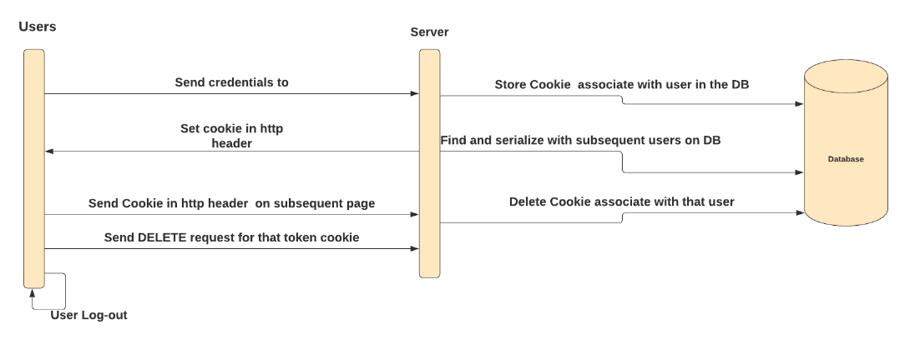
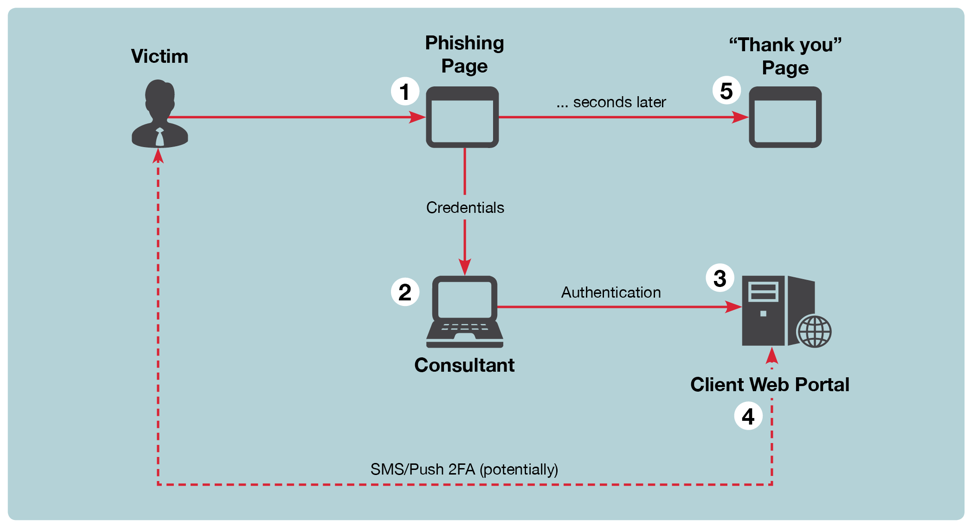

# WebBrowserSecurity (**)

by 
*Adrián Luján Muñoz*

The nature of this document
> After observing and questioning multiple people, I have realized the misinformation and lack of knowledge regarding computer security on the part of a large part of the users who use online services.

## Abstract

This document will address the following aspects of network security (more specifically in the use of the web browser)
> In this article we will discuss some of the attacks most used by cybercriminals to violate the security of web browsers `Firefox`, `Chrome`, `Safari`, `etc` \
> We will explain how to keep the data of our web browsers safe. How to treat our sensitive data to avoid the leaking of said data.

## Most common attacks

#### Cookie-Hijacking

One of the attacks most used today to steal user accounts on Internet platforms `Cookie-Hijacking`. As its own name indicates, it consists of hijacking the user's session.

    This attack has become very famous lately as multiple YouTube channels have been attacked, leaving their rightful owners without access suddenly and surprisingly. Many of these users who are affected state that they had the `Two-Factore authenticate` option activated, so they trusted that their accounts were completely secure.

The great potential for attackers of this and similar attacks is that it does not require a username, password (in order to gain access to the user's session) as well as being able to bypass most of the `Two-Factore authenticate`. \
*Sometimes the password may be necessary to perform actions within the account, this will depend on the actions that the attacker wants to perform within the account and the security level implemented by the web service provider.*

This is a very superficial explanation. In case you want to learn a little more about this type of attack, you can search for information on your own or visit [on this website](https://medium.com/cybersecured/cookie-and-session-based-attacks-cybersecurity-university-by-codepath-unit-2-f2257a22d4c6) which I think explains the bases of the attack very well.

 > - Faked Requests
 > - Cross-Site Request Forgery
 > - Cookie Theft and Manipulation
 > - Other methods

#### Cookie-Hijacking - Sample

To understand how these types of attacks are carried out, we need to know what a session cookie is and how web services perform authentication.

In short, a session cookie allows the server to identify the user. This is very useful since `http` is a communications protocol that treats each request as a separate transaction that has no relation to any previous request (*`stateless protocol`*). This makes it necessary to use `cookies` to be able to *`identify the different clients`*.

As shown in the image, the user `authenticates` with her credentials and the server guive a `cookie` that identifies the session just opened. In case of not closing the session we can access without entering our credentials until the session expires.

The attackers take advantage of the fact that the session is valid to inject the stolen cookie into their browsers. Gained access to the user's account without having to enter any credentials, since the session is the same one that the legitimate user has opened.

    

#### Phishing & Real-time Phishing

This is one of the most well-known methods by the non-specialized public, but even though it is so well known, it is still one of the most effective when it comes to obtaining user credentials. Both with massive `phishing` campaigns in the old fashioned way or with more targeted `spear-phishing` methodologies. In the latter, information is extracted from the person or group of people to whom it will be addressed through `OSINT` methodologies and techniques that allow the attacker to create an attack that is much more effective.

The following image shows a typical phishing attack in a very summarized form, the attacker sends a malicious message to the victim. The message contains a link that, when clicked, leads to a web page where the victim must enter his credentials, the victim enters them thinking that the site is legitimate. Subsequently, the data entered are sent to the attacker, usually the website shows you a login error and redirects you to the real website.

    

In more sophisticated `Real-time Phishing` attacks the malicious website handles a request with the real website to log the user into the real website to prevent the hoax from being discovered. Although in some cases a request is made to the real website and a check is made to see if the user has `Two-Factore authenticate`. If the `Two-Factore authenticate` is active, the user is prompted to obtain an authorized session to which the attacker will have access, then in some cases it is sent to a remote computer that automatically performs the actions desired by the attacker.

    

These types of attacks can get very complicated. If you want more information related to 'Real-time Phishing' attacks, how they work in depth and the danger of this type of attacks, I leave a couple of very interesting [websites](https://www.phishdeck.com/blog/what-is-realtime-phishing/).

> - https://blog.cloudflare.com/2022-07-sms-phishing-attacks/
> - https://www.mandiant.com/resources/blog/reelphish-real-time-two-factor-phishing-tool
> - https://gbhackers.com/real-time-two-factor-phishing-tool/
> - https://www.phishdeck.com/blog/what-is-realtime-phishing/ 
> - https://www.usenix.org/conference/usenixsecurity21/presentation/ulqinaku

#### Stealer

One of the most used due to the amount of data that can be extracted from a computer, not just credentials such as `PasswordStealer`, there are many `Stealers` that are capable of extracting personal information from the user, monitoring their activities, I have informed the attacker . This can allow the theft of sensitive information such as identity documents, which can be used to falsify the person's identity.

Thanks to the data obtained with the `Stealers`, an attacker was able to carry out a large number of attacks and operations to gain `access` to `multiple accounts`, not only of the user himself but of all users who have ever logged in there. team and there left some trace. In addition to obtaining the information of all users who have left a trace on the computer. Here data analysis techniques and `information gathering` come into play, among many other techniques that can allow the attacker to obtain `relevant` and `sensitive` `information` (cookies, credentials, official documents, application database files, KeyPass files, etc).

This type of malware is usually of the Trojan type, which means that the user is tricked into the system, since the user is never aware that a malicious program is installed.

##

> Today there are many people who carry out advertising campaigns, some companies provide them with certain files that at first may seem like a harmless program or a document that seems harmless, but behind the scenes a series of tasks are being carried out to install malicious software.

> The user does not usually find out until the antivirus detects it or they have already told him that the damage has already been done and there is not much to do.

##

## Software implementation

All source code used to generate the results and figures in the paper are in
the `code` folder.
The calculations and figure generation are all run inside
[Jupyter notebooks](http://jupyter.org/).
The data used in this study is provided in `data` and the sources for the
manuscript text and figures are in `manuscript`.
Results generated by the code are saved in `results`.
See the `README.md` files in each directory for a full description.

## Getting the code

You can download a copy of all the files in this repository by cloning the
[git](https://git-scm.com/) repository:

    git clone https://github.com/clhore/WebBrowserSecurity.git

or [download a zip archive](https://github.com/clhore/WebBrowserSecurity/archive/refs/heads/main.zip).

A copy of the repository is also archived at *insert DOI here*

## Dependencies

You'll need a working Python environment to run the code.
The recommended way to set up your environment is through the
[Anaconda Python distribution](https://www.anaconda.com/download/) which
provides the `conda` package manager.
Anaconda can be installed in your user directory and does not interfere with
the system Python installation.
The required dependencies are specified in the file `environment.yml`.

We use `conda` virtual environments to manage the project dependencies in
isolation.
Thus, you can install our dependencies without causing conflicts with your
setup (even with different Python versions).

Run the following command in the repository folder (where `environment.yml`
is located) to create a separate environment and install all required
dependencies in it:

    conda env create

## Reproducing the results

Before running any code you must activate the conda environment:

    source activate ENVIRONMENT_NAME

or, if you're on Windows:

    activate ENVIRONMENT_NAME

This will enable the environment for your current terminal session.
Any subsequent commands will use software that is installed in the environment.

To build and test the software, produce all results and figures, and compile
the manuscript PDF, run this in the top level of the repository:

    make all

If all goes well, the manuscript PDF will be placed in `manuscript/output`.

You can also run individual steps in the process using the `Makefile`s from the
`code` and `manuscript` folders. See the respective `README.md` files for
instructions.

Another way of exploring the code results is to execute the Jupyter notebooks
individually.
To do this, you must first start the notebook server by going into the
repository top level and running:

    jupyter notebook

This will start the server and open your default web browser to the Jupyter
interface. In the page, go into the `code/notebooks` folder and select the
notebook that you wish to view/run.

The notebook is divided into cells (some have text while other have code).
Each cell can be executed using `Shift + Enter`.
Executing text cells does nothing and executing code cells runs the code
and produces it's output.
To execute the whole notebook, run all cells in order.

## License

All source code is made available under a BSD 3-clause license. You can freely
use and modify the code, without warranty, so long as you provide attribution
to the authors. See `LICENSE.md` for the full license text.

The manuscript text is not open source. The authors reserve the rights to the
article content, which is currently submitted for publication in the
JOURNAL NAME.
